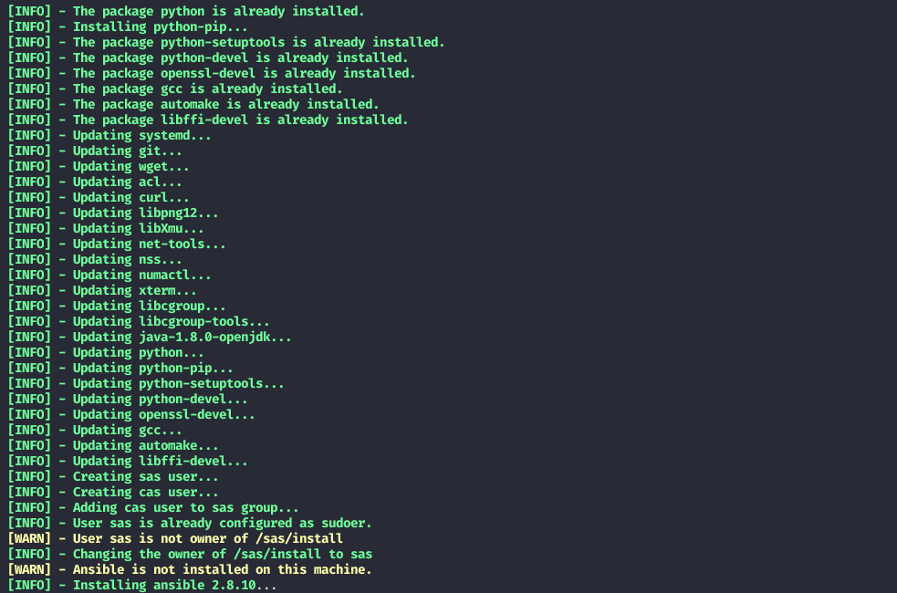

# SAS Viya - Shell-script automation

Script de reaproveitamento de comandos linux para facilitar a instalação do SAS Viya dentro de um servidor.

## Features

- [X] Verificação de conexão com a internet
- [X] Atualização de repositórios
- [X] Anexação do repositório EPEL
- [X] Instalação de packages obrigatórios
- [X] atualização de packages obrigatórios
- [X] Criação de usuário sas e cas
- [X] Adicionar usuário cas no grupo sas
- [X] Colocar o usuário sas como super usuário
- [X] Criar caminho de instalação '/sas/install'
- [X] Instalação do ansible

## Features futuras

- [ ] Baixar SAS Mirror Manager
- [ ] Baixar SAS Orchestration CLI
- [ ] Criar playbook
- [ ] Baixar Viya ARK
- [ ] outras...

